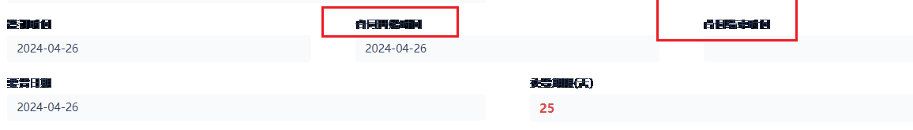

## 后端使用业务对象Create/Update/Remove时，会触发自动化吗？
会触发


## 新版列表后端调试器BUG如何处理？
目前新版列表的后端调试器可能会出现 调试器窗口空白、调试器大小不能拖动调整、表单控件空值 等问题，该BUG已反馈给研发进行修复，临时的解决方案是切到旧版列表页面（注：不会导致整个企业环境切换回旧版）：

在浏览器上登录氚云，地址栏切换到此地址（**注意：不要复制Url直接打开，表单编码、应用编码需要替换成想调试的表单的编码和应用编码**）：
```
https://www.h3yun.com/home.html#/app/#表单编码&code=应用编码
```


## 非调试模式不报错，调试模式弹窗报错
当应用下的后端代码中存在声明变量，但未赋默认值时，就会导致非调试模式下不报错，调试模式下弹出以下错误：
> 系统异常：DoAction 失败 无法将类型为“H3.SmartForm.ResponseContext”的对象强制转换为类型“H3.SmartForm.LoadListViewResponse”

示例：
``` cs
// 会导致异常的变量声明：
string a;
int b;

// 正确的变量声明：
string a = "字符串";
int b = 0;
```

::: tip
另外，如果声明了重名的类，或者复制完表单就报错，也会导致这个报错。
:::

解决方案：
1. 应用下的表单个数少时，可以一个个表单点进去排查。

2. 若代码量多时，则先打开前端调试器，再打开后端调试器，待报错弹出后，  
在前端调试器的network工具下，从上往下查看所有OnAction请求，会在某个请求的响应数据中，有具体的报错信息，以及异常代码所在表单。


## 氚云的页面在钉钉工作台中字体模糊/重影/错位



目前的解决方案：在钉钉中点头像->设置与隐私->高级->开启钉钉容器WebGL特性。

此方式无法解决时，请在浏览器中使用氚云，等待后续研发与钉钉协同解决该问题。


## 为何不推荐利用OnWorkflowInstanceStateChanged事件做导入触发代码的需求
风险点：
1. 导入时，```OnWorkflowInstanceStateChanged``` 事件中代码执行异常不会有任何错误提示及日志记录（注意：正常审批使流程结束时会触发```OnWorkflowInstanceStateChanged``` 事件，并且代码执行异常会弹窗提示）
2. ```OnWorkflowInstanceStateChanged``` 事件完全由流程引擎控制触发，没有设置流程，流程配置有误，或者不是导入生效数据，都不会触发事件。这样对流程设计人员和导入人员都不友好
3. 根据已使用该方案的用户反馈，导入时有小概率未触发 ```OnWorkflowInstanceStateChanged``` 事件，或者导入的一批数据里一部分数据触发了，所以该方案稳定性不够
4. 当导入大量数据时，由于每条数据都会触发 ```OnWorkflowInstanceStateChanged``` 事件，就会导致运行效率很差，易造成超时，这个问题也是导致第3点稳定性差的一个诱因

替代的推荐方案：
1. 在表单中增加2个字段：**执行状态**、**执行结果**
2. 在列表上增加一个【导入数据处理】按钮，并书写列表后端代码，代码中批量查询出 **执行状态** 为“待处理”的数据
3. 执行好业务逻辑后，批量将 **执行状态** 改为“已处理”（注意：最好每次按钮点击只处理一部分数据，推荐限定每次处理前100条待处理数据，以防用户等待时间过久，导致执行超时和按钮的点击请求超时）；若数据有误或者有提示信息，可以将提示信息更新至 **执行结果** 控件中
4. 用户导入数据后，先通过列表筛选出“待处理”的数据，然后点击【导入数据处理】按钮触发代码，直至所有数据处理完成


## 怎样可以通过输入出生日期，计算出年龄？
[教程](https://app2fbcrlcs8626.h5.xiaoeknow.com/p/course/video/v_625e3523e4b01a4851f3a043)


## 氚云中消息提醒代码里面多个执行人是使用数组吗？还是直接拼接就行？
循环去提醒，不要拼接


## 钉钉考勤怎么同步到氚云？ 
教程，参考下https://help.h3yun.com/contents/1155/2296.html


## 表单的图标颜色，可以自定义吗？

不可以


## 氚云地图合作的是高德地图还是百度地图？
高德地图


## 删错的数据有办法恢复吗?
可以做数据恢复，可以联系一下客服


## 出现Connection must be valid and open to rollback transaction报错问题？
   
同时对一条数据进行插入更新删除操作就容易出现这种情况


## 当前表单的状态/表单模式？
``` js
//前端获取表单模式：0为审批/办理 1为办理完结 2为创建 4为查阅
$.SmartForm.ResponseContext.FormMode
```

``` cs
//后端获取表单数据状态
this.Request.BizObject.Status;
``` 


## 设置子流程的时候，父流程中的子表数据能否填充到子流程的主表中吗？
不可以的 如果要实现需要用代码的方式实现


## 怎么获取表单的流程状态？
``` cs
$.SmartForm.ResponseContext.BizObjectStatus 
```


## 今天图片上传一直出现这个问题,doUploadFile fail


重启一下钉钉软件看看


## 用Excel导入数据，要如何导入多条子表的数据?
例如：  


## 业务规则又先后顺序的吗？
数据生效时从上往下执行，删除/重新激活流程从下往上执行


## 接口创建的表单数据触发业务规则跟消息通知吗?
会触发，如果消息通知没触发，看看人员控件的值是否给了固定值，因为在接口创建数据时是不会给人员控件默认值的，有可能没发是因为
人员控件的值是空的，  ```H_User``` 人员基础信息表


## 仪表盘有sql嘛？
仪表盘也支持sql，需要找氚云工作人员开通高级数据源（SQL）的权限。


## 子表的序号可以获取到吗？
表单前端没有子表序号字段，但是子表数组的 ```下标+1``` 即序号。后端可以通过业务对象或数据表中的 ```ParentIndex``` 获取（注：```ParentIndex``` 从0开始，0代表第一行）。


## 新增子表里面的数据的时候可以设置数据行的颜色吗？
不可以的


## 前端自定义代码编写错误，请联系管理员修改
函数名:AfterSubmit;错误信息:SyntaxError:undefined" is not valid JSoN
检查 返回的值是否有为null的或undefined的 只有有值才转成json


## 位置控件限定范围支持多少米以内的定位？
位置控件是调用的钉钉接口，表单设计内设置“限定附近范围”后可限定为只能选择以定位点为中心大概周围 ```500m ```
内的位置，但还是需要注意设备本身定位准确性导致的偏差。


## 有什么办法获取当前表单数据的流程节点吗？
``` cs
H3.Workflow.Instance.IToken tok = this.Request.Engine.WorkflowInstanceManager.GetWorkflowInstance("流程id").GetLastToken();
```


## 氚云有英文版本吗？
氚云系统设计是提供的中文版编写环境，暂时没有英文的表单设计页面版本。  
可由懂中文的氚云系统管理员搭建系统，设置控件名称为英文的，这样可以提供给国外同事来提交表单和查看数据。 


## 一个表单支持多少个控件?
不能超过2万个字符  例如 多行文本控件的最大字符是2000  那么最多只能10个多行文本。


## 关于业务规则执行
对于 ```表单有流程``` 的审批通过之后会执行业务规则,审批不通过不会执行业务规则,
如果 ```表单没有流程``` 数据发生改变(比如新增/删除设置了业务规则) 执行业务规则,```抄送节点```是不会执行业务规则的，
用 ```代码激活``` 的流程节点也是遵循这个
```设置了审批自动通过``` 相当于审批通过


## 复制表单失败
复制表单失败，一般是别的表单删除控件等导致当前表单引用该删除控件的计算公式、业务规则等报错等引起 可以到当前表单的表单设计-重新保存下表单，保存会有提示具体的错误，可以根据错误去更改，错误一般是下述情况：
1. 业务规则写法错误；
2. 子流程流转规则错误 ；
3. 子流程是自动发起，发起的子流程表单业务规则错误；
4. 计算公式缺少引用的控件。


## 导入氚云的数据，消息提醒不会触发吗？
 导入不会触发消息提醒，流程的会</br>
 


## 通过子流程触发的数据 也是不会有消息提醒的吗？
会有的


## 企微定位部分手机不支持问题
我们定位在企微调用的是高德的接口，其对部分手机确实存在兼容性问题，目前无法解决。
目前定位无法保证100%准确，如果用户业务中需要保证100%定位正确，请用户重新考虑业务场景的使用，目前企微的氚云中还做不到。请用户知悉。
我们目前将问题反馈给企微共同优化。 


## 提示：获取signature失败，请与服务商联系!
1. 试用期到期了，被禁用了 
2. 钉钉订单到期，所以在钉钉中无法使用
3. 重新将应用发布快捷方式到工作台使用
4. 如以上不行提供企业名称和引擎编码反馈


## 表单控件上限是多少个？
不能超过2万个字符  例如 多行文本控件的最大字符是2000  那么最多只能10个多行文本,目前大概是80/90个控件


## 表单如何只能创建人编辑？
``` cs
protected override void OnLoad(H3.SmartForm.LoadSmartFormResponse response)
{
    base.OnLoad(response);
    if(this.Request.BizObject.CreatedBy != this.Request.UserContext.UserId && response.Actions.ContainsKey("Edit"))
    {
        response.Actions.Remove("Edit");
    }
}
```


## 导入数据导不进去，错误原因下载不下来，是什么原因？点了就变灰了，实际也没下载出来下载未导入数据
 
 
 在系统管理》全局设置》列表版本 改为新版列表
 

## 可以发布多少个表单到钉钉工作台？
从氚云发布到钉钉工作台的图标上限为50，包括：发布应用，列表，和表单三种图标的总和


## 氚云待办不同步到钉钉待办
1. 先确认流程表单有没有超过200个，第201个表单发起的待办则不显示，删除过的也算，需要手动删除无用的表单，控制在200个以内；
2. 再确定是所有人没同步（检查氚云在钉钉的可见范围是否为全部）还是个别人没同步，个别人没同步需要提供没同步的人员名称并反馈给对应的成功经理去处理。
3. 钉钉的授权到期了，调不了钉钉接口。


## 报表中计算字段显示数值不正确？
数字控件没有赋值时，默认值时null，null与其他数字运算后依然是null。  
1. 可以对参与运算的字段给默认值，比如0；
2. 如果修改数据源不方便，可以改计算字段的公式请参照如下写法，兼容null值。

比如原计算公式为：入库-出库，改为：IF(入库,入库,0) - IF(出库,出库,0)  
注意：左侧计算字段要修改，汇总表中也要编辑修改


## 氚云预览的文件如何进行打印？
预览的文件不支持打印


## 正在进行中还没有结束的流程是怎么通过业务规则更新？
业务规则只会在数据生效后才触发，如果是流程中的数据要触发，要么用自动化功能，要么做一个辅助表，通过子流程在流程过程中生成一个有效的辅助表数据，通过这个辅助表数据触发业务规则


## 现在氚云发布到钉钉工作台的表单或者列表能改名字么？同一个表单，以表单形式和列表形式都发到了钉钉工作台，怎么能做个区分？
改不了


## 用代码Create生成了另外一个表单的数据，那  那个表单里的代码和业务规则会不会执行？
代码不会执行。如果创建的是生效数据，则业务规则会执行


## 如果填充子流程有些字段有值有些字段没有值
存在可能情况：  
1. 检查下子流程表单有没有设置不允许重复录入
2. 检查流程设计填充子流程的配置字段有没有被反写


## 表单前端中如何获取表单中子表序号？
前端：
``` js 
var ctData = this.子表编码.GetValue();//ctData是一个对象数组，数组的下标+1及子表序号
```


## 业务规则生成的数据会生成流程吗？
业务规则新增的数据不会开启流程


## 关于导入常见问题？
1. 报错-导入报错-调用的目标发生了异常
去掉关联表单的数据范围再导入（临时解决方案-后续会优化预计是6.13左右）
2. 导入关联表单报不存在  
（1）导入如果提示不存在，导入的时候可将关联表单暂时去掉数据范围先（临时解决方案预计6.14左右更新）  
（2）导入提示不存在，关联表单组成的数据标题如果是多个字段组成的 暂时先用四个空格隔开原来是用&符号 （临时解决方案预计6.14左右更新）  
（3）列表关联表单筛选不显示，但是表单中显示，关联筛选配置条件类似“关联表单字段==当前表单字段”和CONTAINS函数的 都不行，暂时列表中用关联表单右边的小图标筛选下（临时解决方案预计6.14左右更新）  
（4）导入提示关联表单不存在，检查看看关联表单的数据标题是否为空


## 关于postValue
1. 提交的请求参数都是放在postValue.Data这个字段中
2. 改变postValue.Data的值不会影响表单实际提交到数据库的值


## 导入显示成功，但是实际数据没变
新增是发起节点、更新是结束节点设置字段可写权限，需要检查下是否开放了可写权限


## 企微没有同步组织架构或人员
有可能是存在以下情况
1. 企微管理后台（管理员）>>应用管理，找到氚云的图标，可见范围设置的是看看是不是根节点的（最上面的一个节点）


## 导入报调用目标异常？
1. 可检查导入的文件内容是有存在‘ 这个符号，目前是不支持这个符号导入的。
2. 数据联动有设置字段作为条件但是导入的文件中没有这个字段


## 审批发起后转交另一个处理人，转交后未同意，显示已同意
这个状态是钉钉那边的，那边的状态就 ：已同意 ， 已拒绝 ， 已撤销 ， 待审批 ，待处理，所以目前转交显示已同意更合适


## 业务规则新增的数据会开启流程吗？
业务规则新增的数据不会开启流程


## 仪表盘明细表目前能够支持显示的列？
25列
