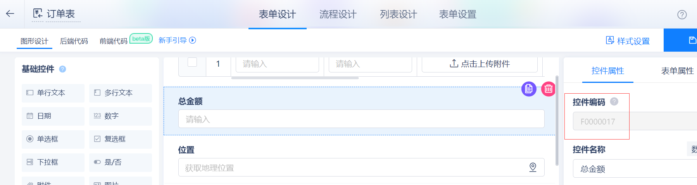

## this

在表单前端事件 ```OnLoad```、```OnLoadActions```、```OnValidate```、```BeforeSubmit```、```AfterSubmit``` 中，均可以通过 ```this``` 关键字得到当前表单实例对象。

```this``` 对象的属性包含当前表单的所有控件实例，比如下面这个控件，就可以使用 ```this.F0000017``` 获取其控件实例对象。



::: tip
由于氚云有的前端API会使用到回调函数，而在回调函数中使用 ```this``` 关键字会出现指向错误，所以建议在外层使用变量将 ```this``` 实例转存，如下：

``` js
// 加载事件
OnLoad: function() {
    var that = this;//使用that变量将this实例转存，供回调函数中使用

    //在BindChange的回调函数中，需将this替换为that
    that.F0000002.BindChange( $.IGuid(), function() {

        //此处将this替换为that
        var projectId = that.F0000002.GetValue();
    });

    //在PostForm的回调函数中，需将this替换为that
    $.SmartForm.PostForm( "GetLatestProjectId_Post", {
        "xx": 11
    }, function( data ) {
        if( data.Errors && data.Errors.length ) {
            $.IShowError( "错误", JSON.stringify( data.Errors ) );
        } else {
            var result = data.ReturnData;

            //此处将this替换为that
            that.F0000002.SetValue(result["projectId"]);
        }
    }, function( error ) {
        $.IShowError( "错误", JSON.stringify( error ) );
    }, false );
},
```
:::


## $.SmartForm.ResponseContext

在表单前端代码中，有一个全局变量 ```$.SmartForm.ResponseContext```，该变量是一个对象，可用于获取到表单的相关信息，包含表单的基本信息（如：表单数据Id、表单数据状态、表单模式、是否移动端等）。

此处只做常用属性介绍，完整说明请移步：[前端实例详解：$.SmartForm.ResponseContext](/doc/js-instance?id=smartformresponsecontext)

**示例**

1. 在表单打开时，判断是否处于新增模式（即通过新增按钮点开的）：

``` js
// 加载事件
OnLoad: function() {

    var that = this;
    if( $.SmartForm.ResponseContext.IsCreateMode ) {
        
    }
},
```

2. 在表单打开时，判断是否处于数据查看模式（即通过列表页数据标题点开的）：

``` js
// 加载事件
OnLoad: function() {

    var that = this;
    if( $.SmartForm.ResponseContext.FormMode == 4 ) {
        
    }
},
```

3. 判断表单所有编辑情况

``` js
// 加载事件
OnLoad: function() {

    var that = this;
    if(
        $.SmartForm.ResponseContext.IsCreateMode || //新增
        $.SmartForm.ResponseContext.BizObjectStatus == 0 || //打开草稿数据
        ( $.SmartForm.ResponseContext.BizObjectStatus == 2 && $.SmartForm.ResponseContext.FormMode == 0 ) || //流程审批中打开
        ( $.SmartForm.ResponseContext.BizObjectStatus == 1 && $.SmartForm.ResponseContext.FormMode == 0 ) //编辑生效数据
    ) {

    }
},
```

4. 在点击 提交/同意 按钮时，判断是否是在某个审批节点点击的：

``` js
// 提交校验
OnValidate: function( actionControl ) {

    var that = this;
    if( actionControl.Action == "Submit" && $.SmartForm.ResponseContext.ActivityCode == "流程节点编码" ) {
         
    }

    return true;
},
```


## 获取控件值

```GetValue``` 是一个控件实例上的函数，使用方式：
``` js
var conValue = that.控件编码.GetValue();
```

不同类型控件，```GetValue``` 返回的值数据结构不同，具体请移步：[表单前端控件GetValue/SetValue](/doc/form-js-set-get)


## 设置控件值

```SetValue``` 是一个控件实例上的函数，使用方式：
``` js
that.控件编码.SetValue(控件值);
```

不同类型控件，```SetValue``` 要求传入的值不同，具体请移步：[表单前端控件GetValue/SetValue](/doc/form-js-set-get)


## 设置控件显示/隐藏

```SetVisible``` 是一个控件实例上的函数，使用方式：
``` js
that.控件编码.SetVisible(true);//显示控件
that.控件编码.SetVisible(false);//隐藏控件
```

```SetVisible``` 可用来 显示/隐藏 子表控件（即整个子表），但如果是设置子表内的控件，请先获取子表内的控件的实例


## 设置控件只读/可写

```SetReadonly``` 是一个控件实例上的函数，使用方式：
``` js
that.控件编码.SetReadonly(true);//设置控件只读
that.控件编码.SetReadonly(false);//设置控件可写
```

```SetReadonly``` 可用来设置 只读/可写 子表控件（即控制子表是否有新增、删除按钮），但如果是设置子表内的控件，请先获取子表内的控件的实例


## 清空选项（下拉框/单选框/多选框）

支持的控件类型：下拉框/单选框/多选框

```ClearItems``` 是一个控件实例上的函数，使用方式：
``` js
that.控件编码.ClearItems();
```

```ClearItems``` 函数只能用于单选框/复选框/下拉框，作用是将控件的选项全部清空。


## 添加选项（下拉框/单选框/多选框）

支持的控件类型：下拉框/单选框/多选框

```AddItem``` 是一个控件实例上的函数，使用方式：
``` js
that.控件编码.AddItem("选项");
```

```AddItem``` 函数只能用于单选框/复选框/下拉框，作用是给控件增加一个选项，函数的传入参数必须是一个字符串。


## 给控件绑定值改变事件

```BindChange``` 是一个事件，一般写在 ```OnLoad``` 事件中，用来在表单打开时绑定上事件监听控件值的改变。

::: warning
函数的第一个参数 ```key``` 是自定义的一个事件标识，但是不可重复。
:::

使用方式：
``` js
that.控件编码.BindChange( "key", function() {
    var v = that.控件编码.GetValue();
});

//如果不想命名key，可以使用 $.IGuid() 来保证key的唯一
that.控件编码.BindChange( $.IGuid(), function() {
    var v = that.控件编码.GetValue();
});
```

```BindChange``` 函数用于绑定一个值改变事件，但是和js的 ```onchange``` 事件不一样。```onchange``` 函数触发时机为实时的值改变，而 ```BindChange``` 在值改变时不触发，在控件焦点离开后才触发。


## 取消绑定值改变事件

```UnbindChange``` 专门用来取消 ```BindChange``` 事件，在 ```BindChange``` 时指定的 ```key``` 在这里就有用处了。

使用方式：
``` js
that.控件编码.UnbindChange("key");
```


## 绑定控件值变化事件

支持的控件类型：单行文本、多行文本、数值

当控件值发生改变后，会立即触发本事件，而 ```BindChange``` 需要在焦点离开控件后才会触发

``` js
that.控件编码.OnTempChange(function(){

});
```


## 绑定控件内键盘按下事件

支持的控件类型：单行文本、多行文本、数值

``` js
that.控件编码.OnKeyDown(function(event){

    //可通过判断 event.keyCode 的值来确定用户按下哪个按键，如 event.keyCode == "enter" 为回车键

    //可先通过console输出按下的按键，来确定需要监听的按键对应的编码
    console.log(event.keyCode);
});
```


## 添加一行子表数据

支持的控件类型：子表

``` js
// 注：此处的子表内控件编码是完整的控件编码，格式：子表编码.控件编码
that.子表编码.AddRow($.IGuid(), {
    "子表内控件编码": "控件值"
});
```


## 清空子表数据

支持的控件类型：子表

``` js
that.子表编码.ClearRows();
```


## 更新子表某行数据

支持的控件类型：子表

``` js
// 注：此处的子表内控件编码是完整的控件编码，格式：子表编码.控件编码
that.子表编码.UpdateRow(子表数据Id, {
    "子表编码.控件编码": "控件值"
});
```


## 获取子表内控件

支持的控件类型：子表

``` js
// 注：此处的子表内控件编码是完整的控件编码，格式：子表编码.控件编码
var cellManager = that.子表编码.GetCellManager(子表数据Id, "子表编码.控件编码");
```


## 获取子表数据条数

支持的控件类型：子表

``` js
var rowCount = that.子表编码.GetRowsCount();
```


## 前端Ajax请求后端

利用Ajax技术，异步请求后端，触发表单后端OnSubmit事件，[使用示例](/docs/js-example?id=表单前端onload事件-bindchange-post-请求后端)。

``` js
$.SmartForm.PostForm(
    actionName, //传给后端的actionName，命名标准：功能名_Post
    data, //传给后端的数据，object类型
    callBack, //请求成功后的回调事件
    errorBack, //请求失败后的回调事件
    async //true：不阻塞，false：请求过程中阻塞后续代码执行
);
```


## 消息弹窗

``` js
$.IShowSuccess( "成功", "这是一条成功消息" );//弹出成功消息

$.IShowWarn( "警告", "这是一条警告消息" );//弹出警告消息

$.IShowError( "错误", "这是一条错误消息" );//弹出错误消息

/*
    注意：
        * $.IConfirm弹窗是属于回调式的，而非阻塞式，调用完此函数，会立马执行后续代码，
        而不会等待用户点击按钮后再执行，所以请勿用在用户提交时

        * 需要阻塞提交动作，请使用js自带的confirm：
        var r=confirm("弹窗内容");
        if (r==true)
        {
            //点击了确认按钮
        }
        else
        {
            //点击了取消按钮
        }
*/
$.IConfirm( "提示", "是否确认？", function( data ) {
    if( data ) {
        //点击确认按钮
    } else {
        //点击取消按钮
    }
});
```


## 以全屏模式打开表单

``` js
var schemaCode = "xxx";// 表单编码
var objectId = "";// 表单数据Id，传 "" 时表示以新增模式打开，传具体数据Id表示打开该条数据表单详情查看页
var checkIsChange = true;// 关闭时是否感知变化，固定传 true
$.IShowForm(schemaCode, objectId, checkIsChange);
```


## 以弹窗模式打开表单

``` js
var schemaCode = "xxx";// 表单编码
var objectId = ""; // 表单数据Id，传 "" 时表示以新增模式打开，传具体数据Id表示打开该条数据表单详情查看页
var params = { "param1": "参数值1", "param2": 200 };// 传递到表单的参数，JSON对象格式（如果要将本表单数据传给弹窗，需先使用GetValue函数获取控件值，再放入params中）
var checkIsChange = false;// 是否检查修改
var showlist = false;// 兼容移动端是否显示列表
var showInModal = true;// 是否弹出框中显示，如果为false，title height width OnShowCallback OnHiddenCallback 等属性不起作用
$.IShowForm(schemaCode, objectId, params, checkIsChange, showlist, {
  showInModal: showInModal, title: "表单页标题", height: 500, width: 800,
  OnShowCallback: function( da ) { },// OnShowCallback 表单打开时事件
  onHiddenCallback: function( data ) {// onHiddenCallback 表单关闭时事件
        //当用户关闭表单后，会触发此事件，并且可以从data参数中获取用户在弹窗中输入的值
        //比如，弹窗表单中有一个控件编码为F0000001的单行文本控件，则获取值方式如下：
        var inputValue = data.Data["F0000001"];
        if(inputValue){
            //用户输入了值
        }else{
            //用户没输入值，进行提示
            $.IShowError( "错误", "请输入xxx的值！" );
        }
  }
});
```


## 获取弹窗调用方传递的参数

如果本表单是通过 `$.IShowForm` 打开的，并且有传递params，则可以通过 `$.IGetParams` 函数获取params中指定属性名对应的属性值。

``` js
var param1 = $.IGetParams("param1");
```


## 获取设备经纬度

1. 用于获取用户当前定位（其精度和位置控件一致），但是仅限钉钉移动端，所以使用前，需要判断一下当前表单所处环境。

示例：
``` js
if ($.SmartForm.ResponseContext.IsMobile) {
    //这里是回调的，data是个对象，属性如下：lat,lng,address，分别表示：纬度，经度，地址信息
    $.ILocation(true, function (data) {
        if (data) {
            alert(data.lat + "," + data.lng + "," + data.address);
        }
        else {
            alert("获取位置错误");
        }
    });
}
```

2. 其他客户端（浏览器、钉钉工作台等），可以使用原生JS代码实现（需注意考虑兼容性）。
示例：
``` js
if ($.SmartForm.ResponseContext.IsMobile) {
    if (navigator && "geolocation" in navigator) {
        navigator.geolocation.getCurrentPosition(function (position) {
                alert("纬度:" + position.coords.latitude);
                alert("经度:" + position.coords.longitude);
            }, function (error) {
                alert("经纬度获取失败：" + error.code + " - " + error.message);
            }
        );
    } else {
        alert("本设备不支持获取经纬度"); 
    };
};
```


## 关闭表单

旧版表单：```$.SmartForm.ClosePage();```

新版表单：```this.ClosePage();```


## 设置控件内容的字体颜色

支持的控件类型：单行文本、多行文本、日期、数值

``` js
that.控件编码.SetColor(Color.Blue);

/*
支持的颜色
Color.Default 默认颜色
Color.Blue    蓝色
Color.Green   绿色
Color.Yellow  黄色
Color.Red     红色
Color.Cyan    青色
Color.Purple  紫色
*/
```


## 设置控件内容的背景颜色

支持的控件类型：单行文本、多行文本、日期、数值

``` js
that.控件编码.SetBgColor(BgColor.Success);

/*
支持的颜色
BgColor.Success   成功消息（绿色）
BgColor.Info      普通消息（）
BgColor.Warning   警告消息（）
BgColor.Error     异常消息（）
*/
```


## 设置控件内容的字体大小

支持的控件类型：单行文本、多行文本、日期、数值

``` js
that.控件编码.SetFontSize(FontSize.Large);

/*
支持的字体大小
FontSize.Small   小号
FontSize.Medium  中等
FontSize.Large   大号
*/
```


## 设置控件内容的字重

支持的控件类型：单行文本、多行文本、日期、数值

``` js
that.控件编码.SetFontWeight(FontWeight.Bold);

/*
支持的字重
FontWeight.Light    对应font-weight 300
FontWeight.Medium   对应font-weight 500
FontWeight.Bold     对应font-weight 700
*/
```


## 设置控件内容的线类型

支持的控件类型：单行文本、多行文本、日期、数值

``` js
that.控件编码.SetLine(LineType.Underline);

/*
支持的字重
LineType.Underline    下划线
LineType.Strikeline   删除线
*/
```


## 表单页面聚焦到指定控件处

支持的控件类型：单行文本、多行文本、数值

``` js
that.控件编码.SetFocus(true);//聚焦并自动滚动到指定控件处
that.控件编码.SetFocus(false);//只聚焦，不自动滚动到指定控件处
```


## 绑定控件聚焦事件

支持的控件类型：单行文本、多行文本、数值

只支持编辑态控件，可以配合 ```SetFocus``` 一起使用，先定义 ```OnFocus``` 监听，后执行 ```SetFocus```

``` js
that.控件编码.OnFocus(function(){

});
```
