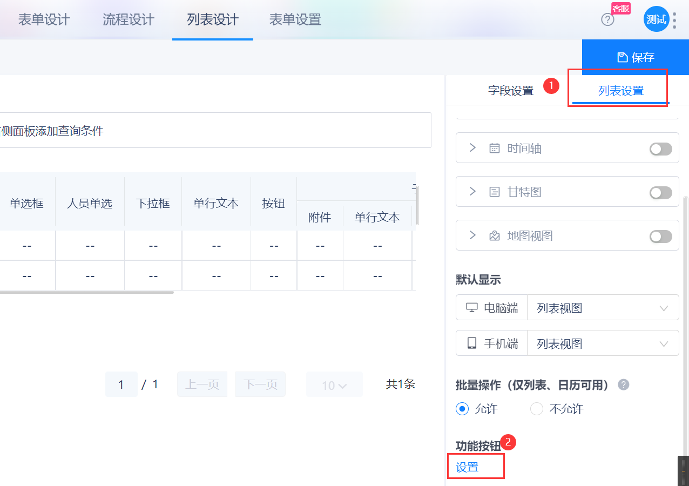

列表页面中的所有操作，都需要在列表设计页面中编写代码，代码需要编写在各种事件内，当对应操作产生时，系统会自动触发事件，以执行用户的自定义代码。


## 列表前端事件

列表前端只有一个事件：```$.ListView.ActionPreDo```，在点击列表按钮时触发该事件，```actionCode``` 参数为按钮编码。

### 平台默认按钮

- Create：新增
- Import：导入
- Export：导出
- Remove：删除
- PrintQrCode：打印二维码

### 配置自定义按钮：



::: warning
**统计分析** 按钮点击不经过该事件。
:::


### ActionPreDo事件代码示例：
``` js
//此处为列表按钮点击事件
$.ListView.ActionPreDo = function( actionCode ) {
    debugger

    //通过actionCode判断用户点击的是自定义按钮 MyBtn
    if( actionCode == "MyBtn" ) {
        //获取列表选中数据
        var datas = $.ListView.GetSelected();
        if( datas && datas.length ) {
            //当有选中数据时，取出选中数据的ObjectId值
            for( var i = 0;i < datas.length;i++ ) {
                alert( datas[ i ][ "ObjectId" ] );
            }
        }
    }

    //通过actionCode判断用户点击删除按钮
    if( actionCode == "Remove" ) {
        //弹出成功状态消息
        $.IShowSuccess( "成功", "点击了删除按钮！" );
    }
};
```


## 列表后端事件

列表后端共有3个事件，其中初始代码中会有2个事件：```OnLoad``` 和 ```OnSubmit```，还有一个 ```OnInit``` 事件在需要时由开发者自行添加到列表类中。

### 列表后端OnLoad事件

```OnLoad``` 为列表页数据加载事件，每次在加载列表数据时会触发 ```OnLoad``` 事件，比如：列表页初始打开、筛选条件变化、切换分页、按某列排序等，都会触发本事件。

其中 ```base.OnLoad(response);``` 为默认处理，有以下效果：
1. 根据请求中的筛选条件，查询数据并设置到 ```response``` 上，以响应给前端渲染

::: warning
此行代码=> ```base.OnLoad(response);``` 请保证触发 ```OnLoad``` 事件时都能得到执行（不要删除该行代码，尽量不要放在 `if` 判断体内），否则将失去以上列举的效果。
:::


### 列表后端OnSubmit事件

```OnSubmit``` 在**按钮点击**或**Post请求**时触发，此事件的 ```actionName``` 参数非常重要，标识了触发来源。当按钮点击时，```actionName``` 即按钮编码；当Post请求时，```actionName``` 即前端自定义的请求活动名称。

其中 ```base.OnSubmit(actionName, postValue, response);``` 为默认处理，有以下效果：
1. ```actionName``` 为 ```Remove```（即 删除）时，会根据请求中传递的用户选中数据Id，查询并删除对应数据，若删除的是生效数据，则内部自动触发作废的业务规则

::: warning
此行代码=> ```base.OnSubmit(actionName, postValue, response);``` 请保证触发 ```OnSubmit``` 事件时都能得到执行（不要删除该行代码，尽量不要放在 `if` 判断体内），否则将失去以上列举的效果。
:::


### 列表后端OnInit事件

当列表页初始打开时，会触发 ```OnInit``` 事件，并且执行时机上比 ```OnLoad``` 更早一步（先加载列表页面再加载列表数据）。

这个事件主要用于设置列表初始按钮显示/隐藏、初始筛选条件、初始排序字段、初始分页设置等，这些操作都会在 ```base.OnInit(response);``` 中完成，所以如果要二次开发调整这些设置，也应该在 ```base.OnInit(response);``` 之后写代码。


## 列表页加载时的事件触发顺序图

> 制作中...


## 列表按钮点击时的事件触发顺序图

> 制作中...