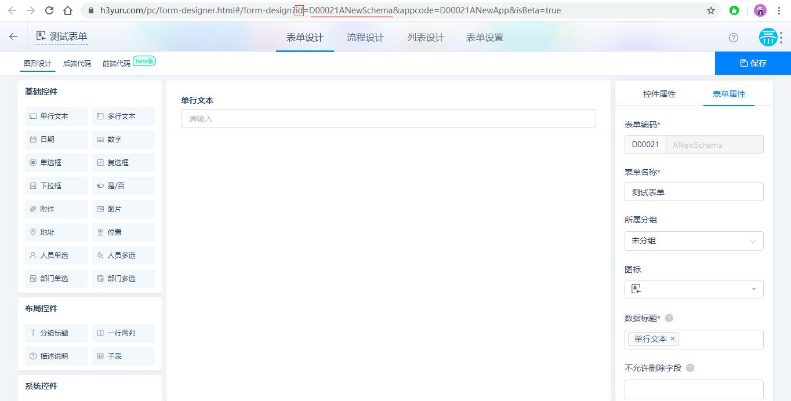
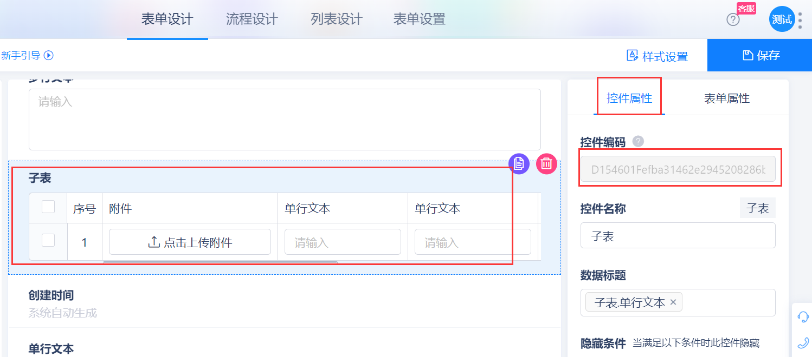

本篇介绍氚云系统中各种编码的查看方式。

## 应用编码查看

1. 查看方式一：
点击应用重命名 --> 弹出应用信息框 --> 双击选择应用编码复制即可


2. 查看方式二：
在浏览器里打开氚云 --> 打开应用内任意一个表单 --> 点击【设计表单】按钮 --> 查看当前网页URL中的appcode参数值（appcode参数值即应用编码）


## 表单编码查看

1. 查看方式一：
点击 **设计表单** 按钮 --> 点击表单属性 --> 找到表单编码 --> 双击选择表单编码复制即可 

::: warning
若该表单是在专业版下创建的，灰色框前的 `D00021` 也属于表单编码的一部分；而原先在标准版环境下创建，或者是模板表单，灰色框前的 `D00021` 并不属于表单编码。

所以，更推荐使用 **方式二** 进行查看，可以无需分辨获取到准确表单编码。
:::


2. 查看方式二：
点击 **设计表单** 按钮 --> 查看当前网页URL中的id参数值 *id参数值即表单的完整编码，无需判断是否专业版下创建*




## 主表控件编码查看

点击 **设计表单** 按钮 --> 点击要查看的控件 --> 右边 **控件属性** 栏内，控件编码框内即为控件编码


## 子表编码查看

点击 **设计表单** 按钮 --> 在设计页面点击子表控件 --> 右边控件属性中的控件编码即子表编码（*注：编码很长，注意复制完整*）




## 子表内控件编码查看

点击 **设计表单** 按钮 --> 子表里的控件 --> 右边 **控件属性** 栏内，控件编码框内即为控件编码（*注：编码很长，只想复制后半部分可用鼠标往右拖动*）


::: warning
子表内的控件编码格式是 **子表控件编码.控件编码** ，但代码中使用时有不同的使用形式：

- 在前端获取控件实例时用完整编码，例：完整编码是 ```D154601FChildTable.F0000001``` ，取用此完整编码
- 在获取数据时只需要取用后半部分，例：完整编码是 ```D154601FChildTable.F0000001``` ，只取用 ```F0000001``` 即可
:::

