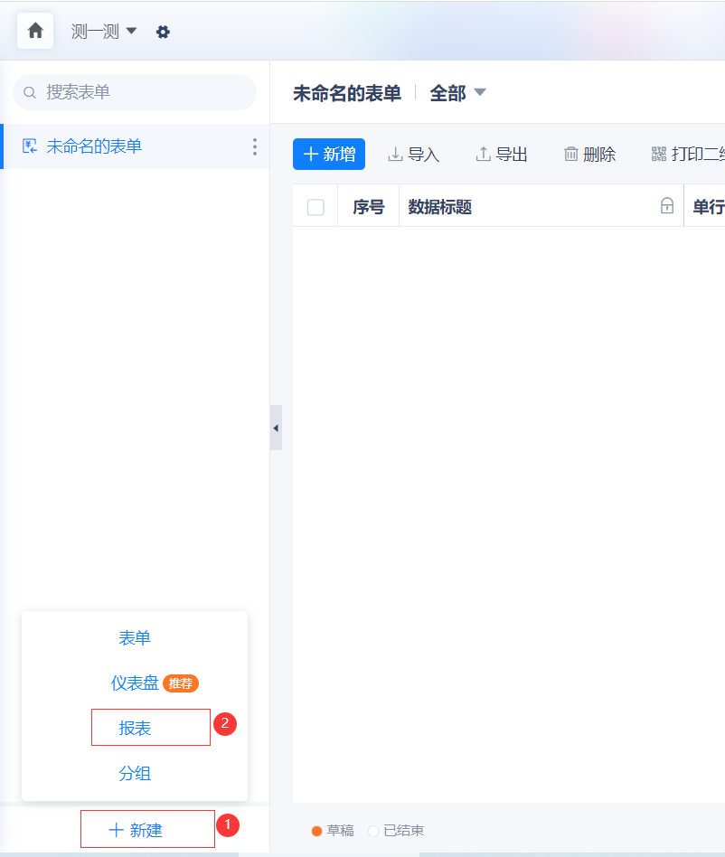

报表支持配置SQL数据源，通过编写SQL语句查询数据库，将查询结果展示在报表中。

**重要说明：产品已不维护SQL报表（不接受新增需求，不修复BUG），如需使用SQL报表请替换为使用 ```SQL高级数据源``` + ```仪表盘``` 的方式实现。**


## 使用SQL报表来测试SQL语句

如果需要测试 ```SELECT``` 语句，也可以通过这两种方式进行测试。

::: warning
SQL报表 只能用于测试 ```SELECT``` 语句，不支持执行这些语句： ```DDL```（如：CREATE TABLE）、```DML```（如：INSERT/UPDATE/DELETE）、```DCL```（如：COMMIT/ROLLBACK）、```TCL```（如：事务）。
:::


## 使用方式

* 第一步：新增一个报表：


* 第二步：新增数据源，并选择“自定义Sql”：
