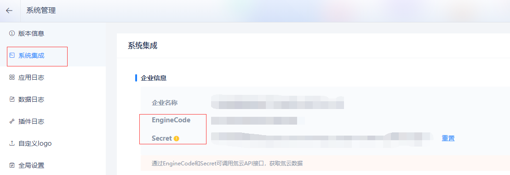

氚云默认对所有表单数据提供了 创建、修改、删除、查询 4类接口，开发者可以借助这些接口能力，实现企业系统与氚云的集成。  
并且也支持用户在氚云上编写自定义接口，提供给第三方调用，以实现个性化需求。


## 对接前必读

::: warning
调用氚云接口时，需使用 HTTPS 协议、JSON 数据格式、UTF-8 编码、POST请求、Content-Type: application/json。  
**调用频率：1-2 次/秒，请求超时时间：<= 60 秒**
:::

并且需要在请求Headers中添加身份校验参数：**EngineCode**、**EngineSecret**，身份校验参数查看路径：**头像** -> **系统管理** -> **系统集成**





### 请求示例代码

[【.NET Core】氚云OpenApi请求辅助类](/file/RequestH3yunAPI.cs ':ignore :target=_blank')

[【Java】氚云OpenApi请求示例](/file/Java-调用氚云接口.zip ':ignore :target=_blank')


## 查询单条业务数据

LoadBizObject 为加载单个数据，请勿使用该接口来循环加载数据，可以使用LoadBizObjects 来批量加载数据。

<!-- tabs:start -->

#### **Api说明**

请求方式：POST（HTTPS）

请求地址：https://www.h3yun.com/OpenApi/Invoke

请求包体：
~~~ cs
{
    "ActionName": "LoadBizObject",
    "SchemaCode": "D0015994821985e8b434394bc0737ffb22a0584",
    "BizObjectId": "b1540570-d463-4325-8ca1-759ec3d7aa03"
}
~~~

参数说明：

| 参数                 | 参数类型                       | 必须                   | 说明        |
|--------------------|----------------------------|----------------------|-----------|
| ActionName         | ```String```               | 是                   | 调用的方法名    |
| SchemaCode         | ```String```               | 是                   | 需要查询的表单编码 |
| BizObjectId        | ```String```               | 是                   | 需要查询的数据ID，每个表单都有唯一的ObjectId        |

工具Postman请求：


返回结果：

| 参数            | 说明                   |
|---------------|----------------------|
| Successful    | 返回结果是否成功true/false   |
| ErrorMessage  | 错误信息                 |
| Logined       | 未使用，忽略               |
| ReturnData    | 返回的数据                |
| DataType      | 返回的数据类型，默认0          |

#### **代码示例（C#）**

~~~ cs
using Newtonsoft.Json;
using System.Net;
using System.Text;

//查询单条业务数据-第三方调用氚云OpenApi
LoadBizObject();

void LoadBizObject()
{
    //请求地址
    string apiAddress = @"https://www.h3yun.com/OpenApi/Invoke";
    HttpWebRequest request = (System.Net.HttpWebRequest)WebRequest.Create(apiAddress);
    request.Method = "POST";//请求方式
    request.ContentType = "application/json";
    //身份认证参数
    request.Headers.Add("EngineCode", "系统集成中的引擎编码");
    request.Headers.Add("EngineSecret", "系统集成中EngineSecret");
    //参数
    Dictionary<string, object> dicParams = new Dictionary<string, object>();
    dicParams.Add("ActionName", "LoadBizObject");
    dicParams.Add("SchemaCode", "表单编码");
    dicParams.Add("BizObjectId", "数据Id");
    string jsonData = JsonConvert.SerializeObject(dicParams);//序列化参数
    byte[] bytes = System.Text.Encoding.UTF8.GetBytes(jsonData);
    request.ContentLength = bytes.Length;
    //将请求数据写入请求数据流
    using (Stream writer = request.GetRequestStream())
    {
        writer.Write(bytes, 0, bytes.Length);
        writer.Close();
    }
    //定义用于接收响应数据的变量
    string strValue = string.Empty;
    //请求并获取响应数据
    using (System.Net.HttpWebResponse response = (System.Net.HttpWebResponse)request.GetResponse())
    {
        using (System.IO.Stream resStream = response.GetResponseStream())
        {
            string chuck = null;
            using (StreamReader reader = new StreamReader(resStream, Encoding.UTF8))
            {
                while ((chuck = reader.ReadLine()) != null)
                {
                    strValue += chuck + "\r\n";
                }
            }
        }
    }
    //输出返回结果
    Console.WriteLine(strValue);
}
~~~

<!-- tabs:end -->


## 创建单条业务数据

::: warning
通过本接口创建的数据，若生效，会触发生效的业务规则
:::

| 参数            |      数据类型       |   必填            |       说明              |
|---------------|----------------------|----------------------|----------------------|
| IsSubmit           | ```Bool```                 | 是                   | 是否提交    |

::: warning
**```IsSubmit``` 参数具体说明：**  
无流程表单，```IsSubmit``` 传 ```false ``` 创建草稿数据，传 ```true``` 创建生效数据。  
有流程表单，```IsSubmit``` 传 ```false``` 创建进行中数据，但处于发起节点；传 ```true``` 创建进行中数据并流转到下一个节点（按请求数据中 ```OwnerId``` 为提交人自动提交，若未传 ```OwnerId```，则由管理员作为提交人）。
:::
